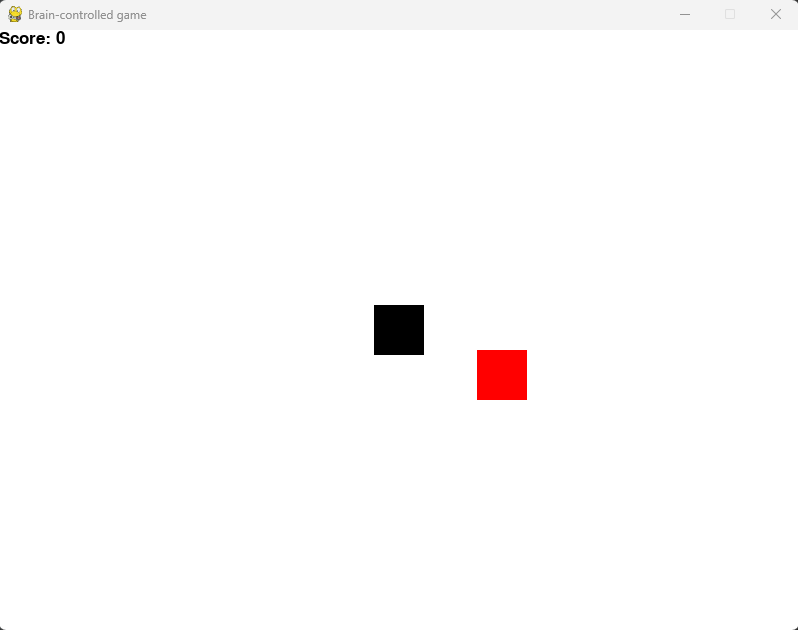

# Bachelor Thesis Project: Analyse der Verwendbarkeit von nicht-invasiven Brain Computer Interfaces zur Steuerung von Benutzereingaben am PC

This study will investigate the usefulness of non-invasive Brain Computer Interfaces (BCIs) for manipulating computer user inputs. The research looks on the ability of BCIs to give an alternative input method for those who are unable to utilize standard input devices such a keyboard or mouse owing to physical limitations.

## Acknowledgments
This project was made possible with the help of the developers of the Emotiv Cortex API, which provided the code in the
 `emotiv_code` folder. We would like to give credit to the Emotiv team for their contribution to the field of Brain Computer Interfaces and for making their code available to the open source community.

To learn more about Emotiv Cortex API and their work, visit their GitHub repository at https://github.com/Emotiv/cortex-v2-example.

## Projects

- Control the mouse with thoughts or facial expression
- Play a game with facial expression

## Repository Contents
- game_BCI/ - contains a game controlled by bci.
- EEG-recorded_data/ - Real-time recording and export of EEG data from a real person.
- emotiv_code/ - contains the code from Emotiv Cortex API
- Mouse_BCI/ - contains the code of the mouse project

## Prerequisites
To use this code, you will need the following:

A developer license from Emotiv. You can learn more about Emotiv's licensing options and apply for
a developer license on their website at https://www.emotiv.com/developer/. A Cortex app on the
Emotiv website. To create a Cortex app, log in to your Emotiv account and go to the Developer
Dashboard. From there, you can create a new app and obtain a `client_id` and `client_secret` 
that are required to use the Emotiv Cortex API.

It is also necessary to connect to an EEG headset or emotiv launcher virtual headset.

## Installation
To run the project, you will need Python and the following Python packages:

- socket
- pygame
- mouse

To install the packages, run the following command:

`pip install -r requirements.txt`

## Usage

To run the game_bci project, you must first run `python server.py` and then run `python game.py`. For the Mouse_BCI 
project, you must run `python train_feedback_live.py`.